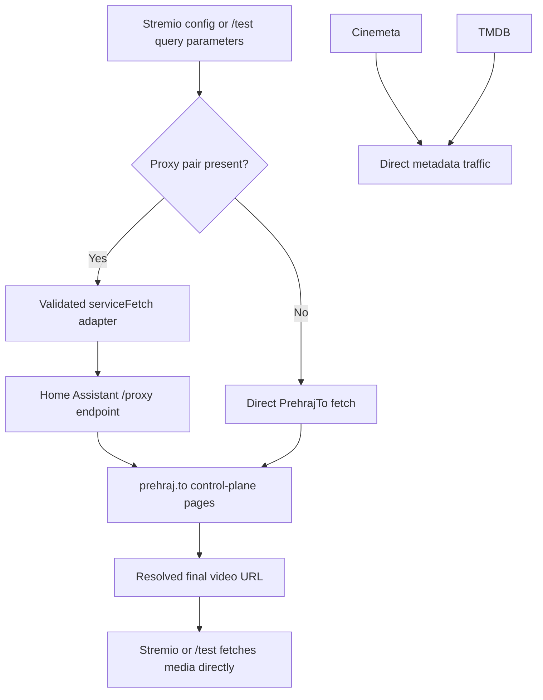

# Home Assistant HTTP Egress Proxy Integration Plan

## Summary

Replace the add-on-hosted debugging relay with optional Home Assistant egress-proxy routing for PrehrajTo control-plane requests. Keep Cinemeta, TMDB, and final media traffic direct, and let `/test` opt into the proxy through query parameters while retaining direct mode by default.

---

## Problem Frame

The add-on currently has an environment-driven relay at `/internal/service-proxy`. Its bearer-token protocol, buffered base64 envelopes, and server-side allowlist are incompatible with the Home Assistant proxy, which accepts `X-API-Key` plus a `{url, method, headers, body}` wrapper and streams the upstream response directly.

Normal installed-addon proxy settings must come from the Stremio configuration page and arrive in `UserConfigData`. The `/test` endpoint has a separate debugging lifecycle: it must continue to work without a proxy and may receive proxy URL and API key as query parameters for an individual test.

The proxy boundary is intentionally limited to PrehrajTo anonymous session, login, search, and detail-page requests. Cinemeta and TMDB remain direct. After detail resolution, the add-on returns the final video URL and Stremio fetches the media directly.

---

## Requirements

### Configuration and validation

- R1. The Stremio configuration page exposes the complete proxy endpoint as a text field and its API key as a password field.
- R2. When both fields are absent, installed-addon PrehrajTo requests retain direct behavior.
- R3. When both fields are present, every PrehrajTo control-plane request uses the Home Assistant proxy.
- R4. Partial, malformed, or unsafe proxy configuration fails without falling back to direct egress.
- R5. A proxy endpoint must use HTTPS, contain no embedded credentials, use the expected `/proxy` path, and resolve only to globally routable addresses.
- R6. The connection uses the DNS address approved by validation while retaining the original hostname for TLS, preventing DNS-rebinding bypass.
- R7. API keys, PrehrajTo credentials, cookies, wrapped bodies, and target query strings are absent from application errors and logs.

### Request routing

- R8. PrehrajTo anonymous-session, login, search, and detail-page requests are the only requests eligible for proxy routing.
- R9. Cinemeta and TMDB requests remain direct.
- R10. Each proxied call uses `POST`, `X-API-Key`, and the documented `{url, method, headers, body}` wrapper.
- R11. Request headers, multipart login data, cookies, upstream status, response headers, and response bodies remain usable by the existing resolver.
- R12. The outer proxy request never auto-follows an upstream `Location`.
- R13. Redirects may be reissued through the proxy only when they remain HTTPS on the exact `prehraj.to` origin; all other redirects fail.
- R14. Proxy-generated and upstream failures use generic sanitized query errors because equal HTTP status codes are not distinguishable in the proxy protocol.

### Media and debugging boundary

- R15. `/media` queries the selected PrehrajTo detail page through the configured transport, then returns the final video URL unchanged in a redirect.
- R16. The add-on does not proxy or buffer final video or subtitle bytes.
- R17. `/test` continues to work in direct mode when proxy query parameters are absent.
- R18. `/test` accepts proxy URL and API key together as query parameters to proxy its PrehrajTo login/search/detail calls for that request.
- R19. `/test` always performs its final media range request directly, even when its PrehrajTo queries used the proxy.
- R20. The inbound `/internal/service-proxy` endpoint, old relay implementation, environment variables, tests, and documentation are removed.
- R21. PrehrajTo authentication sessions are not reused across direct/proxy modes or different proxy identities.

---

## Key Technical Decisions

- KTD1. **Keep the fetch-compatible seam:** rewrite `serviceFetch` around the Home Assistant protocol so PrehrajTo parsing and cookie logic stay transport-independent.
- KTD2. **Preserve optional direct mode:** no proxy settings means direct fetch; both settings mean proxy mode; partial or invalid settings fail closed.
- KTD3. **Build transport per request:** normal resolver calls derive transport from `UserConfigData`, while `/test` derives it from its optional query parameters.
- KTD4. **Validate both hops:** the add-on validates the user-supplied proxy endpoint to protect its own network; Home Assistant independently validates wrapped targets against its `prehraj.to` allowlist.
- KTD5. **Follow redirects only through new wrappers:** outer fetch uses manual redirect mode. Up to five same-origin `prehraj.to` redirects may be converted to new proxy requests using standard method/body transition rules.
- KTD6. **Keep unrelated metadata direct:** `src/meta.ts` and `src/service/tmdb.ts` remain unchanged by the transport migration.
- KTD7. **Keep lazy video resolution:** `/media` still queries the detail page only when selected, then redirects directly to the video URL. This work does not add subtitle metadata to the existing video-only lazy flow.
- KTD8. **Partition authentication cache by transport:** direct mode and each normalized proxy endpoint/API-key identity get separate cached PrehrajTo session headers.
- KTD9. **Accept explicit `/test` query-string credentials with safeguards:** this user-selected debug interface documents URL/history/log exposure, validates both parameters, redacts request paths, and never echoes values.

---

## High-Level Technical Design

This diagram is directional guidance, not an implementation specification.

The adapter validates the outer proxy endpoint separately from the wrapped upstream target. Every redirected PrehrajTo target must remain `https://prehraj.to` and must be submitted as another wrapper; Node never follows the proxy response directly.

---

## Implementation Units

### U1. Configuration contracts and proxy-endpoint policy

- **Goal:** Add the installed-addon fields and share strict parsing between installed and `/test` configuration sources.
- **Requirements:** R1-R7, R17, and R18.
- **Dependencies:** None.
- **Files:**
  - Modify `addon.ts`
  - Modify `src/userConfig/userConfig.ts`
  - Rewrite `src/proxy/config.ts`
  - Create `src/proxy/targetPolicy.ts`
  - Rewrite `tests/proxy/config.test.ts`
  - Create `tests/proxy/targetPolicy.test.ts`
  - Create `tests/addonManifest.test.ts`
- **Approach:** Add `proxyUrl` and `proxyApiKey` before resolver-specific manifest fields. Parse installed values from `UserConfigData` and `/test` values from `URLSearchParams` through one both-or-neither validator.
- **Approach:** Return direct mode only when both values are absent. Trim and normalize configured values; reject credentials, unsafe scheme/port/path, and invalid combinations.
- **Approach:** Resolve every proxy-host DNS answer, reject private, reserved, loopback, link-local, metadata, or otherwise non-global addresses, and pin an approved address while retaining TLS SNI. Loopback HTTP is available only to injected test dependencies, never runtime user configuration.
- **Patterns to follow:** Use the current manifest text/password types and keep endpoint policy separate from request serialization.
- **Test scenarios:**
  1. The manifest contains proxy URL text and API-key password fields alongside PrehrajTo credentials.
  2. No values select direct mode; a valid public HTTPS `/proxy` URL plus non-empty key select proxy mode.
  3. Either value alone, invalid URLs, credentials, wrong paths, unexpected ports, and public HTTP fail.
  4. Private IPv4/IPv6, loopback, link-local, metadata, mixed safe/unsafe DNS answers, and rebinding attempts fail before credentials are sent.
  5. Installed config and `/test` query parsing produce the same normalized transport configuration.
- **Verification:** Valid direct and proxy modes are unambiguous, and unsafe proxy endpoints never receive credential-bearing wrappers.

### U2. Home Assistant proxy fetch adapter

- **Goal:** Translate the subset of standard `fetch` used by PrehrajTo into the Home Assistant protocol and return a standard `Response`.
- **Requirements:** R5-R14.
- **Dependencies:** U1.
- **Files:**
  - Rewrite `src/proxy/serviceFetch.ts`
  - Delete `src/proxy/protocol.ts`
  - Rewrite `tests/proxy/serviceFetch.test.ts`
  - Delete `tests/proxy/protocol.test.ts`
  - Modify `package.json`
  - Modify `package-lock.json`
- **Approach:** Make `createServiceFetch` accept parsed optional configuration plus injectable DNS/outer-request dependencies. Direct mode delegates unchanged; proxy mode normalizes input through `Request`, converts headers to a plain object, serializes non-GET/HEAD bodies as strings, and sends the wrapper with `X-API-Key`.
- **Approach:** Preserve every response. Resolver call sites decide whether a status is acceptable and emit generic sanitized service/stage/status context without claiming whether the status originated at the proxy or upstream.
- **Technical design:** Set `redirect: "manual"` on outer requests. Resolve upstream redirects against the prior target, require exact HTTPS `prehraj.to` origin, apply standard method/body transitions, and cap the loop at five.
- **Patterns to follow:** Preserve dependency injection and the `Response` contract from the existing adapter. Use `undici` connection primitives where global fetch cannot express address pinning.
- **Test scenarios:**
  1. Direct mode delegates input and init unchanged.
  2. Proxy GET and POST calls produce the exact endpoint, `X-API-Key`, target URL/method, plain-object headers, and correct body presence.
  3. PrehrajTo `FormData` preserves its multipart boundary and field values in the wrapper string.
  4. API keys never appear in wrapped target headers, diagnostics, or errors.
  5. Status, HTML body, `set-cookie`, and application headers remain readable.
  6. Upstream 400, 401, 403, 502, and 504 responses pass through without being misclassified as confirmed proxy failures.
  7. Same-origin 302 and 307 responses apply correct method/body semantics through another wrapper.
  8. Cross-origin, downgrade, credential-bearing, looping, and over-limit redirects fail; the outer transport never receives a direct PrehrajTo URL.
- **Verification:** Direct mode remains behaviorally unchanged, while proxy mode matches the Home Assistant contract and cannot bypass it.

### U3. PrehrajTo resolver and lazy media integration

- **Goal:** Select the correct transport for all PrehrajTo control-plane calls without changing unrelated metadata or final media traffic.
- **Requirements:** R2-R16 and R21.
- **Dependencies:** U1 and U2.
- **Files:**
  - Modify `src/service/prehrajto.ts`
  - Modify `src/getTopItems.ts`
  - Modify `src/endpoints/getMediaUrl.ts`
  - Modify `tests/proxy/prehrajtoTransport.test.ts`
  - Modify `tests/prehrajto/fixtureFetch.ts`
  - Modify `tests/prehrajto/fixtureParsing.test.ts`
  - Create `tests/endpoints/getMediaUrl.test.ts`
- **Approach:** Create the transport from the supplied `UserConfigData` inside resolver validation, search, resolve, and debug flows. Pass it through existing login, search, and detail helpers.
- **Approach:** Check control-plane status before parsing. Include a canonical, length-delimited SHA-256 fingerprint of normalized proxy endpoint and API key in proxy-mode cache identity; use an explicit direct-mode discriminator and never log either identity.
- **Approach:** Preserve `/media` and its current configuration lifecycle. Parse resolver name and media ID from `URL.pathname`, not raw `req.url`, so the configuration query cannot contaminate the detail URL.
- **Execution note:** Preserve fixture-based characterization coverage before changing transport selection.
- **Patterns to follow:** Keep injected fetch helper boundaries and checked-in HTML fixtures. Leave `src/meta.ts` and `src/service/tmdb.ts` direct.
- **Test scenarios:**
  1. Without proxy fields, anonymous session, login, search, and detail use the injected direct transport.
  2. With both fields, those same four operations use the Home Assistant adapter.
  3. Cookies returned in either mode are sent on later PrehrajTo calls.
  4. Fixture search parsing and final video extraction remain unchanged.
  5. No final video or subtitle host is passed to the adapter or fetched by resolver code.
  6. Partial or unsafe settings fail before any direct PrehrajTo request.
  7. Direct mode and different proxy identities do not share cached sessions.
  8. `/media` query parameters never become part of the resolver ID and its 301 location is the unchanged final video URL.
- **Verification:** Only PrehrajTo control traffic changes route, and direct media behavior is preserved.

### U4. `/test`, old-relay removal, and operational documentation

- **Goal:** Preserve the debug endpoint under the new routing contract and retire only the superseded relay.
- **Requirements:** R7 and R16-R20.
- **Dependencies:** U1-U3.
- **Files:**
  - Modify `server.ts`
  - Modify `src/endpoints/test.ts`
  - Delete `src/endpoints/serviceProxy.ts`
  - Delete `src/proxy/relay.ts`
  - Delete `tests/proxy/relay.test.ts`
  - Delete `tests/proxy/serviceProxy.integration.test.ts`
  - Create `tests/endpoints/test.test.ts`
  - Modify `.env.example`
  - Modify `README.md`
- **Approach:** Keep `/test` and its existing `q`/`breakpoint` behavior. Add optional `proxyUrl` and `proxyApiKey` query parameters parsed by U1. Use the resulting transport only for resolver validation/search/detail; keep the final range `fetch(videoUrl)` explicitly global/direct.
- **Approach:** Remove `/internal/service-proxy`, the old relay, and all `SERVICE_PROXY_*` configuration. Document the Home Assistant `prehraj.to` allowlist, normal config fields, `/test` query syntax, and direct-media boundary.
- **Approach:** Treat `/test` proxy parameters as sensitive URLs: never echo or log them, redact query strings at application/CDN/reverse-proxy layers, use no-store/referrer controls where supported, and recommend immediate key rotation after suspected disclosure.
- **Test scenarios:**
  1. `/test` without proxy parameters sends PrehrajTo queries directly and performs the final media range request directly.
  2. `/test` with both valid parameters sends only PrehrajTo queries to the proxy; the final range request still targets the media URL directly.
  3. Partial or invalid `/test` proxy parameters fail before any PrehrajTo or media request.
  4. `/test` errors and logs contain none of the proxy URL, key, PrehrajTo credentials, target query, or media query.
  5. `/internal/service-proxy` is no longer intercepted, and repository search finds no active old relay environment variables or bearer protocol.
  6. Full integration fakes confirm Cinemeta/TMDB remain direct, PrehrajTo routing follows configuration, and final media remains direct.
- **Verification:** Type checking, linting, and the full Vitest suite pass; README describes both normal configuration and safe temporary `/test` usage.

---

## Scope Boundaries

### In scope

- Optional proxy routing for active PrehrajTo session, login, search, and detail requests.
- Proxy URL and API-key fields on the Stremio configuration page.
- Optional `/test` proxy URL and API-key query parameters.
- Strict proxy-endpoint validation, same-origin redirect handling, and removal of the old inbound relay.

### Deferred to follow-up work

- Migrating inactive Fastshare, Hellspy, SledujTeto, or Webshare resolvers before they are re-enabled.
- Replacing Stremio’s URL-encoded configuration transport with a server-side secret store.

### Out of scope

- Proxying Cinemeta, TMDB, final video bytes, subtitle bytes, or arbitrary add-on traffic.
- Removing `/test`.
- Changing the Home Assistant proxy API, upstream policy, or Cloudflare deployment.

---

## Acceptance Examples

- AE1. Given no proxy settings, when Stremio requests streams, then Cinemeta, TMDB, and PrehrajTo retain direct behavior.
- AE2. Given valid installed proxy settings, when Stremio requests streams, then only PrehrajTo control wrappers reach Home Assistant.
- AE3. Given a selected result, when `/media` resolves it, then the detail page follows configured direct/proxy mode and the response redirects to the unchanged video URL.
- AE4. Given `/test` without proxy parameters, when the debug flow runs, then queries and the final range request are direct.
- AE5. Given `/test` with a valid proxy pair, when the debug flow runs, then its PrehrajTo queries use Home Assistant and its final range request remains direct.
- AE6. Given partial or unsafe settings from either configuration source, when the flow begins, then it fails without a direct fallback.

---

## Risks and Dependencies

- **Configured-URL exposure:** Stremio config and explicit `/test` query parameters place secrets in URLs. Password masking does not prevent browser, CDN, or access-log retention; deployment must redact queries/paths and support rotation.
- **Proxy endpoint trust:** The configured endpoint receives PrehrajTo credentials and cookies. Public-address validation and pinned connections protect the add-on network, but users must enter only their trusted Home Assistant endpoint.
- **Multipart fidelity:** The proxy accepts a string body rather than base64. Local integration tests must verify the exact login form and UTF-8 behavior.
- **Redirect semantics:** The proxy does not follow redirects. The adapter must enforce exact-origin redirects without direct outer-fetch fallback.
- **Cloudflare policy:** The two requested fields do not carry Cloudflare Access service-token headers. The edge rule must admit the deployed add-on by another mechanism, or a later configuration extension is required.

---

## Documentation and Operational Notes

- Configure exact Home Assistant `allowed_hosts` with `prehraj.to`.
- Enter the complete public endpoint ending in `/proxy` and the API key on the Stremio configuration page when proxy mode is desired.
- For a one-off debug run, pass both proxy values to `/test`; omit both for direct mode.
- Verify Home Assistant logs show only `prehraj.to` control requests while Cinemeta, TMDB, and the final media host remain direct.
- Protect the proxy with TLS and edge access control, sanitize logs, and rotate the key after suspected URL disclosure.

---

## Sources and Research

- `README.md` and the existing resolver implementation define the PrehrajTo control-plane/media boundary.
- `addon.ts` and `src/userConfig/userConfig.ts` define the Stremio configuration fields and per-request config.
- `src/service/prehrajto.ts` contains the four active control-plane calls and authentication cache.
- `src/getTopItems.ts`, `src/endpoints/getMediaUrl.ts`, and `src/endpoints/test.ts` define lazy media and debug flows.
- The supplied Home Assistant proxy README and source define the `X-API-Key`, wrapper body, streamed response, exact-host allowlist, DNS pinning, and no-auto-redirect contract.
